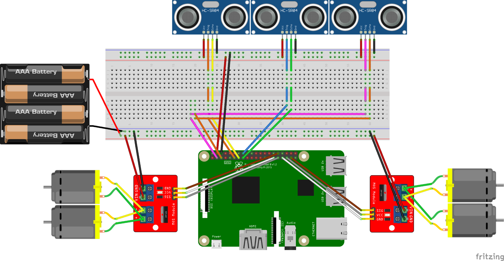
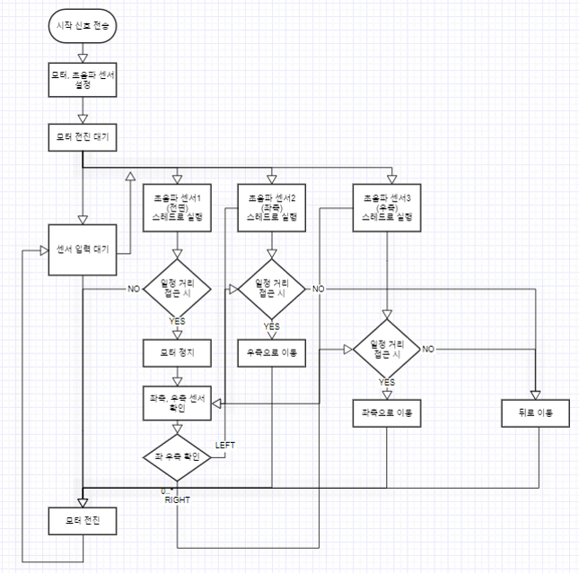
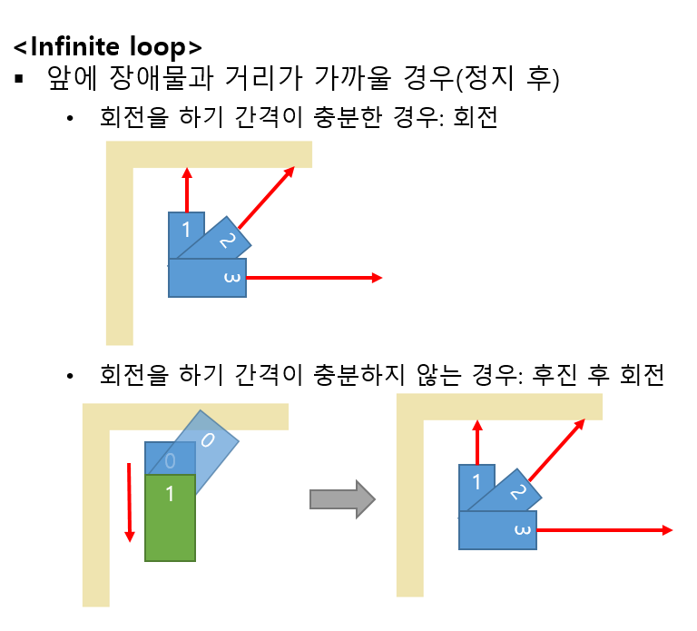
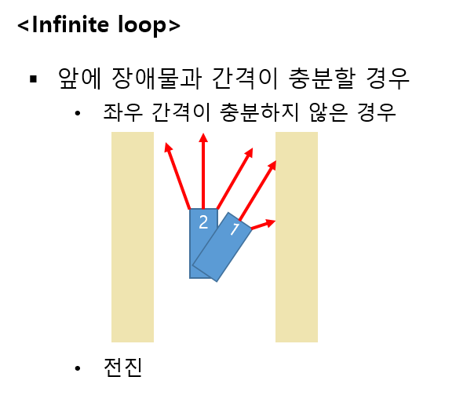

# 자율 주행 자동차

## 1. 프로젝트 목적

초음파 센서와 카메라를 통해 장애물을 인식하고 스스로 속력, 방향을 제어하여 주어진 트랙을 주행하는 자동차를 제작한다.


## 2. Role & Responsibility

참여 인원: 4인
- 윤희승: 기능 통합, 영상 처리 알고리즘 개발
- 이찬솔: 초음파 센서 기능 구현
- 정가희: 회로도 및 하드웨어 제작, 자율 주행 알고리즘 개발
- 조지현: 모터 동작 구현

## 3. 프로젝트 개발 및 실행 환경

개발 및 실행 환경
- Python
- OpenCV
- Raspbian OS : Rasberry Pi 4
- RealVNC
- VSCode: remote SSH

## 4. 프로젝트 내용

### 4.1. 회로도



### 4.2. Flow Chart



### 4.3. 모터 드라이버, DC 모터

- 모터 클래스 구현
    ```python
    class Motor:
        # 모터 초기화
        # en: pwm, 모터 gpio 설정 초기화
        def __init__(self, en, in1, in2):

        # 앞으로 동작, 기본 속도 30%
        # in1 HIGH, in2 LOW
        def forward(self, speed = 30):

        # 뒤로 동작, 기본 속도 30%
        # in1 LOW, in2 HIGH
        def backward(self, speed = 30):

        # 브레이크
        # in1 HIGH, in2 HIGH
        def stop(self):

        # 모터(pwm) 종료
        def exit(self):
    ```

- 좌, 우 모터 객체 생성
- 정방향, 역방향 회전 함수 구현
    ```python
    def car_Turn_CCW(R_motor, L_motor, speed = turn_speed):
        print("CCW, left")
        R_motor.forward(speed+10)
        L_motor.backward(speed-10)
  
    def car_Turn_CW(R_motor, L_motor, speed = turn_speed):
        print("CW, right")
        R_motor.backward(speed-10)
        L_motor.forward(speed+10)
    ```

- 코드: [Moter](./motor.py)

### 4.4. 초음파 센서

- 초음파 센서 클래스 구현
    ```python
    class UltraSonar(threading.Thread):
    
        # 초음파 gpio 설정 초기화
        def __init__(self, TRIG, ECHO, name):
            threading.Thread.__init__(self)
        
        # 초음파 센서의 거리 측정 알고리즘
        def dist_check(self):
        
        # 비이상적인 거리 값을 제거하기 위해 일정 개수의 거리 값을 받아 평균 값을 반환
        def interpolation(self):

        # 스레드 생성 후 실행되는 함수
        def run(self):
    ```

- 코드: [Ultra sonar](./ultrasonar.py)

### 4.5. 카메라
- 카메라 클래스 구현
    ```python
    class Camera(threading.Thread):
        # Pi Camera 초기 설정 
        def __init__(self, size):
        
        # Pi Camera, cv window 종료
        def close(self):

        # 스레드 실행 함수
        def run(self):
    ```
- 코드: [Camera](./camera.py)
- 정리 링크: [여기 눌러 주세요](https://heeseungyoon.github.io/Autonomous-car-camera/)


### 4.6. 자율 주행 알고리즘





## 5. 실행 결과

유튜브 링크: <https://www.youtube.com/shorts/ju_hKaOMGw0>

## 6. 개선이 필요한 사항

- 카메라 높이로 인한 트랙 오인식
- 카메라 프레임 딜레이 존재
- 주어진 트랙에 한정적으로 동작하도록 구현

---
Contact: <iyhs1858@gmail.com>


